# Contoso Retail Sales Analysis

## 1. Introduction / Overview
* **Goal:** To analyze sales patterns for the fictional Contoso retail company using a subset of their data, identifying key trends and drivers
* **Dataset:** Contoso sample dataset (subset) simulating retail business data, including sales transactions, product details, customer information, and store data.
* **Tools:** Python data science ecosystem, PostgreSQL, Jupyter Notebook, Git.

## 2. Business Questions
* Analyze overall sales performance and temporal trends (monthly KPIs, seasonality).
* Evaluate product portfolio performance (profitability, pricing).
* Gain insights into customer behavior and segmentation (demographics, RFM).
* Assess store and regional performance.

## 3. Data Source
* **Source:** Dataset from Luke Barousse's Intermediate SQL for Data Analytics Course
* **Tables Used:** `sales`, `product`, `customer`, `store`

## 4. Data Cleaning & Preparation
1.  **Connection:** Established connection to PostgreSQL using SQLAlchemy.
2.  **Loading:** Loaded `sales`, `product`, `customer`, `store` tables into pandas DataFrames.
3.  **Indexing:** Set primary key columns (`productkey`, `customerkey`, `storekey`) as the index for respective dimension tables (`product_df`, `customer_df`, `store_df`) to optimize merges. Verified key uniqueness.
4.  **Date Handling:** Converted `orderdate` and `deliverydate` columns in `sales_df` to datetime objects using `pd.to_datetime`.
5.  **Merging:** Created a central `analysis_df` by performing left merges: `sales_df` -> `product_df` -> `customer_df` -> `store_df` based on their respective keys. Verified merge integrity (row counts).
6.  **Metric Calculation:** Calculated line-item level totals based on per-unit columns:
    * `line_revenue = quantity * netprice`
    * `line_cost = quantity * unitcost`
    * `line_profit = line_revenue - line_cost`
7.  **Currency Conversion:** Standardized monetary values (`line_revenue`, `line_cost`, `line_profit`) to USD using the `exchangerate` column (assuming `exchangerate` = Local Currency units per 1 USD). Created `revenue_usd`, `cost_usd`, `profit_usd`. Handled potential division by zero/null exchange rates.
8.  **Final DataFrame:** Stored the results in `analysis_df_processed`.
9.  **DateTimeIndex:** Set the `orderdate` column as the `DateTimeIndex` for `df` and sorted the index for time series analysis.
10. **Result:** The final `df` DataFrame has shape (199873, 64 columns) and is ready for analysis.

## 5. Analysis & Findings
### Theme 1: Temporal Sales Analysis
* **Monthly KPIs:** Analyzed trends for Total Revenue (USD), Total Units Sold, and Average Revenue per Order (USD) on a monthly basis.
    * Identified distinct phases in Total Revenue (USD): consistent growth (2015-2019), a plateau period in 2020, followed by a rebound and renewed growth from 2021 onwards.
    * Despite overall revenue growth, the Average Revenue per Order (USD) displayed a gradual downward trend across the decade, indicating that increases in total revenue were primarily driven by higher order volumes rather than increased spending per individual order.

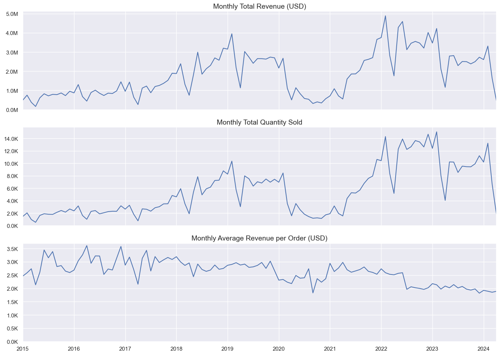

* **Seasonality:** Investigated monthly seasonality patterns in Total Revenue (USD).
    * Pronounced seasonality was confirmed: sales volumes consistently build during the second half of the year, reaching a clear peak in December. The period between March and May typically represents the annual sales trough.
    * Analysis of monthly revenue distributions suggested greater year-over-year variability in sales performance during the first half of the calendar year compared to the more consistent second half.

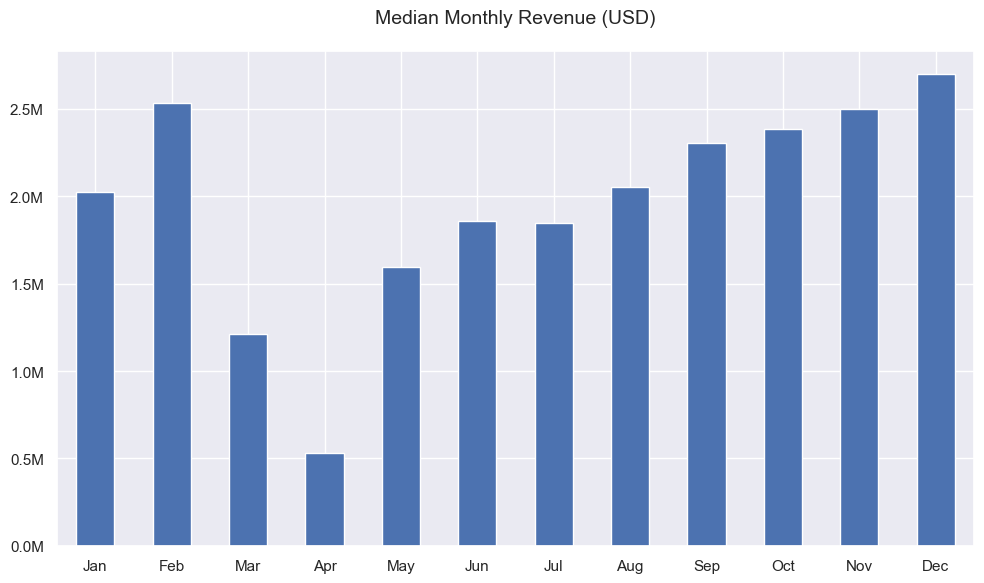

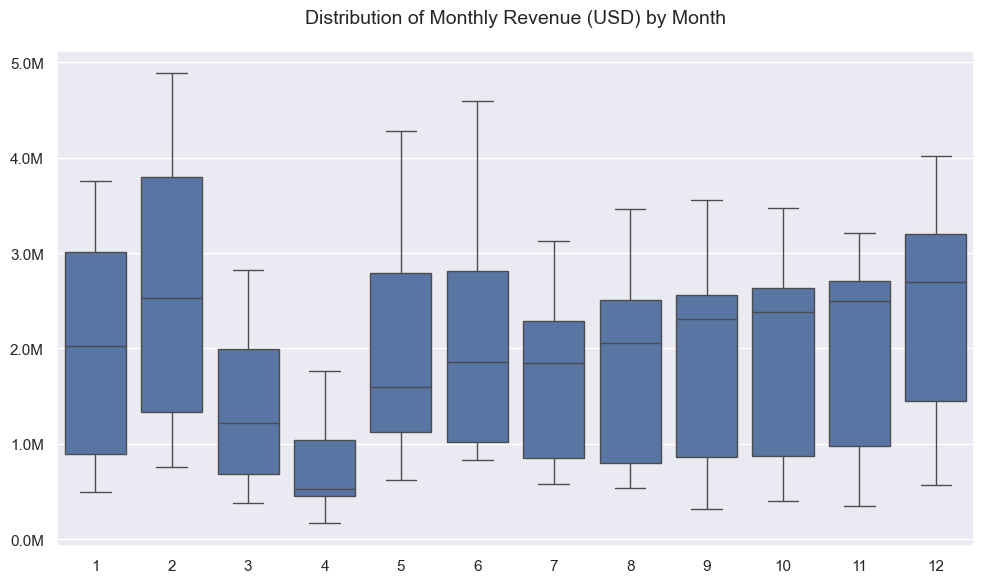

### Theme 2: Product Performance
* **Category & Subcategory Analysis:** Examined Total Revenue (USD), Total Profit (USD), and Profit Margin (%) across product categories and subcategories.
    * The 'Computers' category emerged as the dominant revenue driver. Within this category and others, key subcategories generally exhibited healthy profit margins, typically ranging from 50% to 60%.
    * 'Desktops' and 'Projectors' were identified as the primary subcategory profit centers during the analysis period.

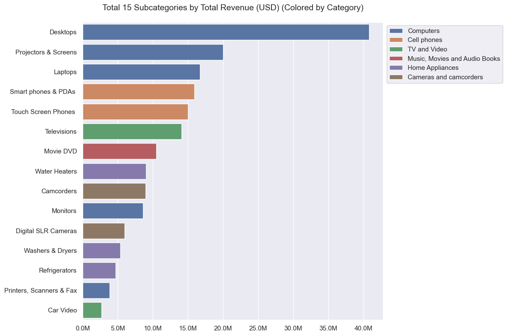

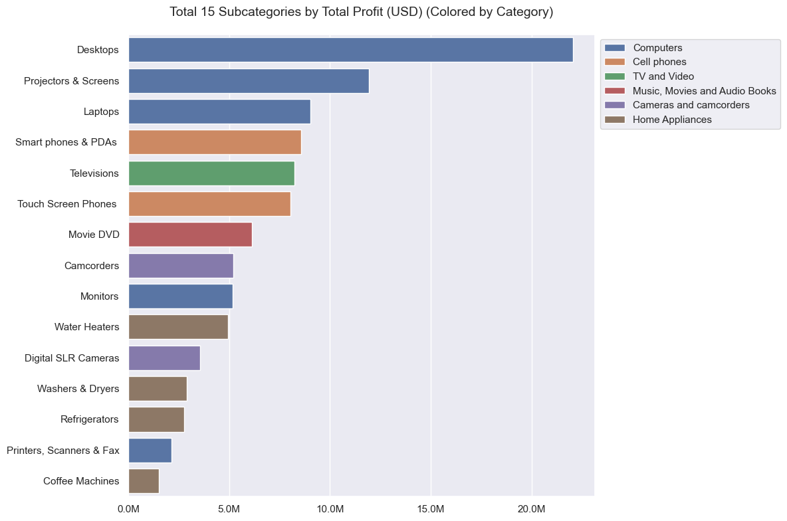

* **Top Products (Yearly Contribution):** Analyzed the contribution of the Top 10 most profitable products within each year.
    * The analysis indicated that the Top 10 products consistently accounted for 7% to 13% of the total annual profit.
    * A modest downward trend was observed in this contribution percentage over the years, suggesting a slight decrease in profit concentration among the highest-performing products over time.
    * Key Visualization: Dual-axis line plot showing the absolute profit of the Top 10 products per year alongside their percentage contribution to that year's total profit.

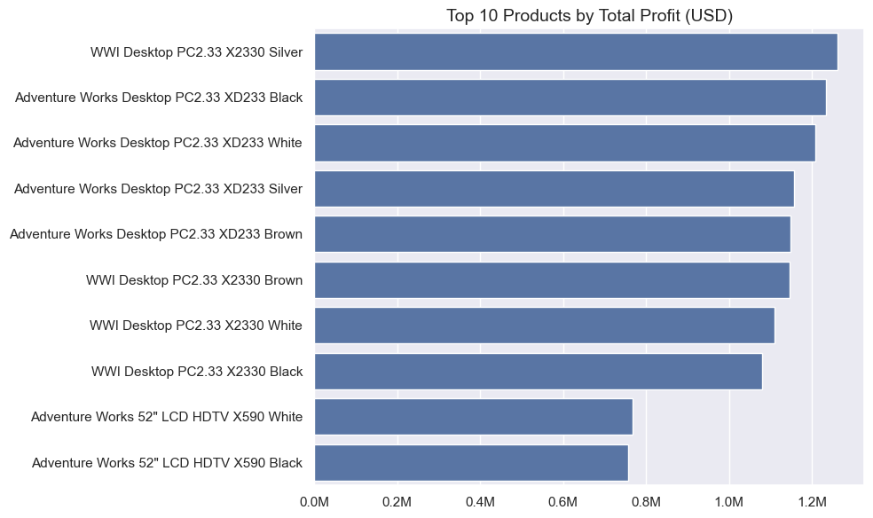

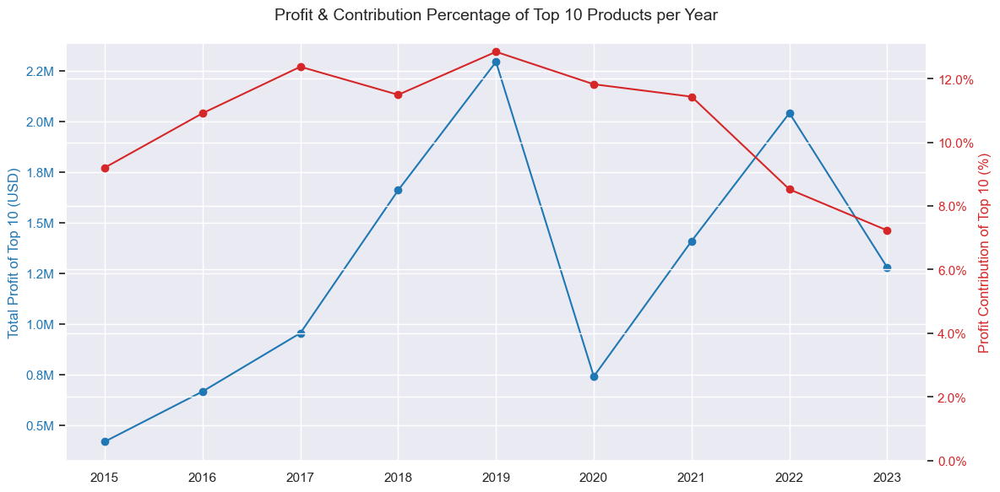

### Theme 3: Customer Insights
* **Demographics & Spending** Analyzed the distribution of unique customers and their associated spending patterns across key demographics.
    * Demographic analysis revealed a near-even gender distribution. Notably, the 65+ age group constitutes the largest customer cohort and demonstrates significantly higher average spending, with their average revenue per customer approximately double that observed across other age groups. Geographically, while the United States has the highest volume of customers, those in the United Kingdom and Germany exhibit greater average spending per customer.

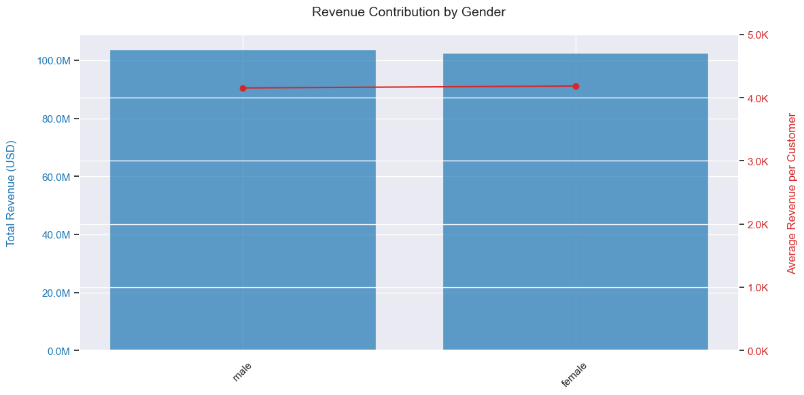

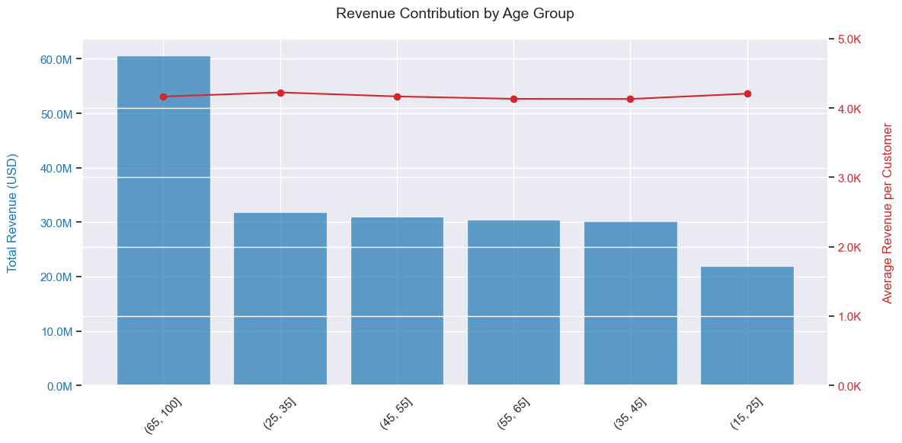

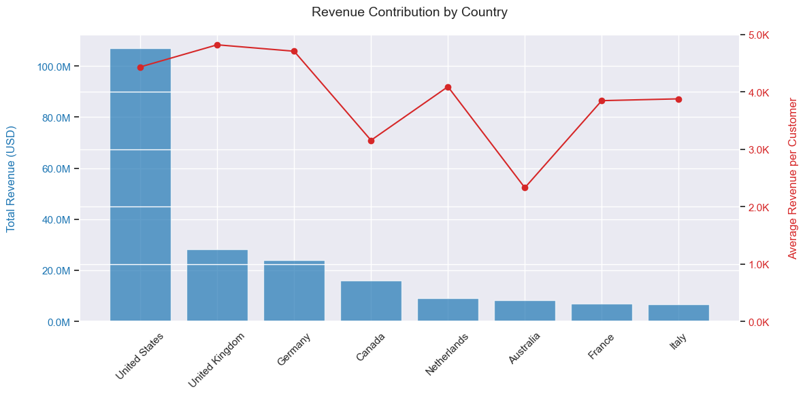

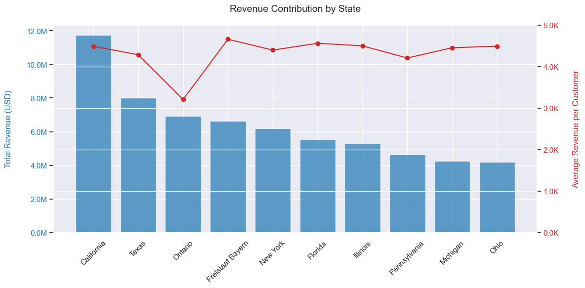

* **RFM Segmentation** Performed Recency, Frequency, Monetary (RFM) analysis to segment customers based on their purchasing behavior (using USD).
    * Calculated Recency (days since last purchase), Frequency (number of unique orders), and Monetary (total USD revenue) for each customer.
    * Developed RFM scores (1-5 scale) using quantiles (with rank-based scoring for Frequency due to data skew).
    * Defined customer segments based on RFM score patterns using regex mapping.

    | Segment                      |   Count |   Percentage |
    |:-----------------------------|--------:|-------------:|
    | Hibernating/Lost             |   10659 |         21.5 |
    | Potential Loyalists          |    8787 |         17.8 |
    | Loyal Customers              |    8102 |         16.4 |
    | At Risk                      |    5779 |         11.7 |
    | Champions                    |    3740 |          7.6 |
    | Infrequent - Mid Recency     |    3566 |          7.2 |
    | Slipping - Low Value         |    2552 |          5.2 |
    | Active Loyalists - Med Value |    2463 |          5   |
    | Other - Unclassified         |    2420 |          4.9 |
    | Need Attention - Low Value   |     957 |          1.9 |
    | Need Attention               |     462 |          0.9 |

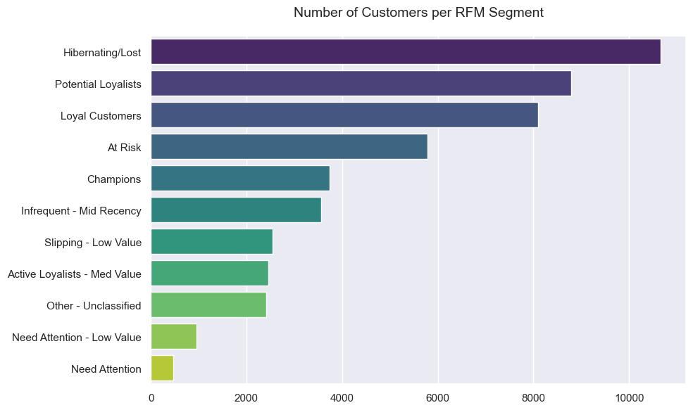

### Theme 4: Store & Regional Performance
* Evaluate and compare the financial performance of different physical store locations or geographic regions.

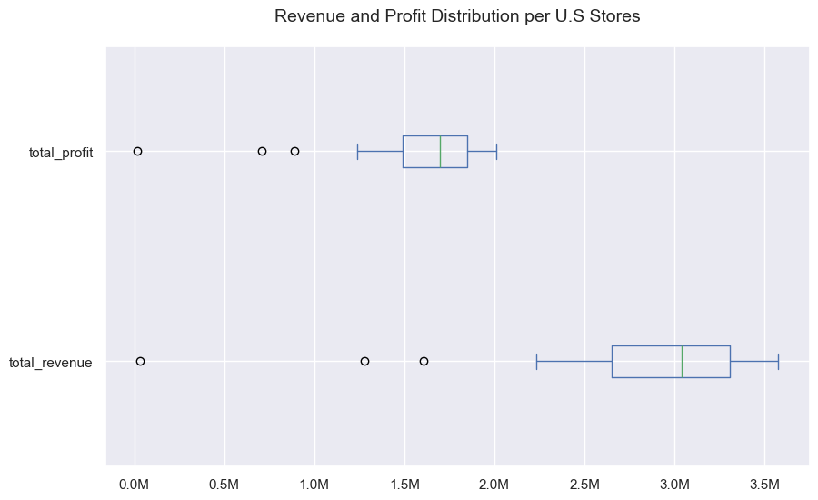

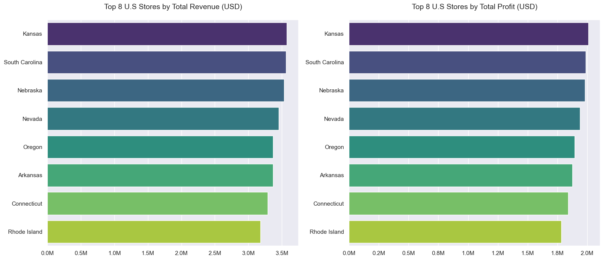

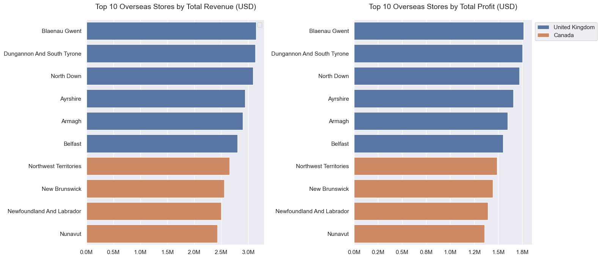

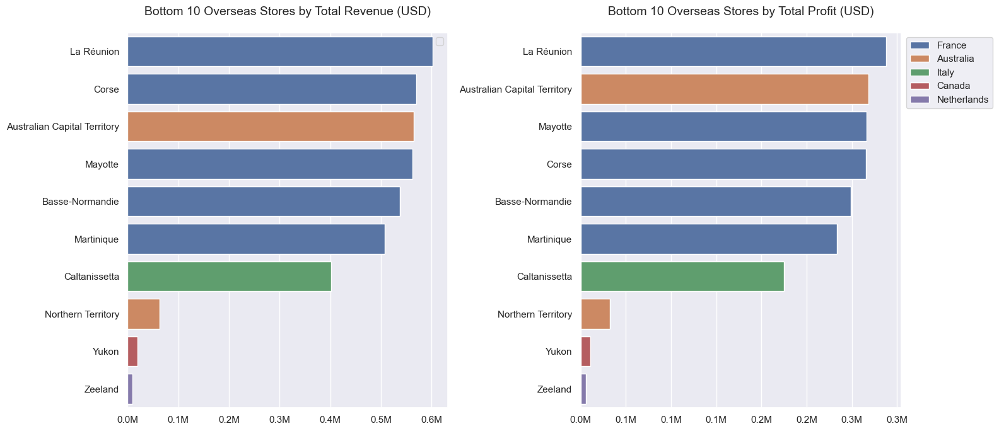